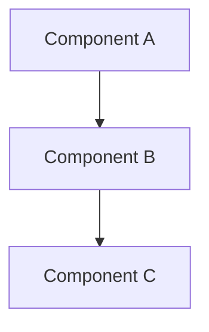

# {Feature Title}

**Status**: Planning | In Development | Under Review | Complete  
**Date**: {Date}  
**Complexity**: COMPLEX

## Overview

{Brief description of the feature, bug fix, or refactoring task}

**Context**: {Why is this needed? What problem does it solve?}

**Motivation**: {What are the benefits? What improves?}

**Success Criteria**:
- {Criterion 1}
- {Criterion 2}
- {Criterion 3}

---

## Requirements

### Functional Requirements

{What the system will do - list the key behaviors and capabilities}

1. {Requirement 1}
2. {Requirement 2}
3. {Requirement 3}

### Non-Functional Requirements

{Performance, security, scalability, maintainability requirements}

- **Performance**: {expectations}
- **Security**: {considerations}
- **Scalability**: {considerations}
- **Maintainability**: {considerations}

### Constraints & Dependencies

{Technical limitations, external dependencies, existing systems to work with}

- {Constraint 1}
- {Constraint 2}

### Out of Scope

{What will NOT be included in this implementation}

- {Out of scope item 1}
- {Out of scope item 2}

---

## Architecture

### Current Structure

{Describe the current architecture/implementation if this is a refactoring or enhancement}

```
{Diagram or description of current state}
```

### New/Proposed Structure

{Describe the proposed architecture/implementation}

```
{Diagram or description of new state}
```

{Include Mermaid diagrams where helpful}



---

## Design Decisions

### Architectural Considerations

{High-level architectural choices and rationale}

### Technology Choices

{What technologies, libraries, frameworks will be used and why}

- **Technology 1**: {Rationale}
- **Technology 2**: {Rationale}

### Design Patterns

{Which design patterns will be applied and why}

### Module-Specific Guidelines

{Which project-specific instruction files apply}

- Follow `.github/instructions/{module}.instructions.md`

### Data Models & API Contracts

{If applicable, document data structures, schemas, API interfaces}

```typescript
// Example data model
interface Example {
  field1: string;
  field2: number;
}
```

---

## Technical Details

### Implementation Specifics

{Key technical details that will guide implementation}

### Schemas/Configuration

{Database schemas, configuration file formats, etc.}

### API Changes

{If applicable, document API endpoints, request/response formats}

---

## Edge Cases & Considerations

### Known Challenges

{Technical challenges expected during implementation}

1. {Challenge 1 and mitigation approach}
2. {Challenge 2 and mitigation approach}

### Edge Cases

{Unusual scenarios that need special handling}

- {Edge case 1}
- {Edge case 2}

### Security Considerations

{Security implications and how they'll be addressed}

- {Security consideration 1}
- {Security consideration 2}

### Performance Implications

{How this change affects performance, what optimizations are planned}

---

## Testing Strategy

### Unit Tests

{What unit tests are needed}

- {Test area 1}
- {Test area 2}

### Integration Tests

{What integration tests are needed}

- {Test area 1}
- {Test area 2}

### E2E Tests

{What end-to-end tests are needed}

- {Test scenario 1}
- {Test scenario 2}

### Manual Testing

{Manual testing scenarios and checklists}

---

## Success Criteria

{Checklist of criteria that define when this feature is complete}

- [ ] {Criterion 1}
- [ ] {Criterion 2}
- [ ] {Criterion 3}
- [ ] All tests pass
- [ ] Documentation updated
- [ ] Code reviewed and approved

---

## Out of Scope

{Reiterate what is explicitly not included}

- {Item 1}
- {Item 2}

---

## References

- [Related Documentation](../path-to-doc.md)
- [Module Instructions](../../.github/instructions/module.instructions.md)
- [Related Issues/PRs](#)
