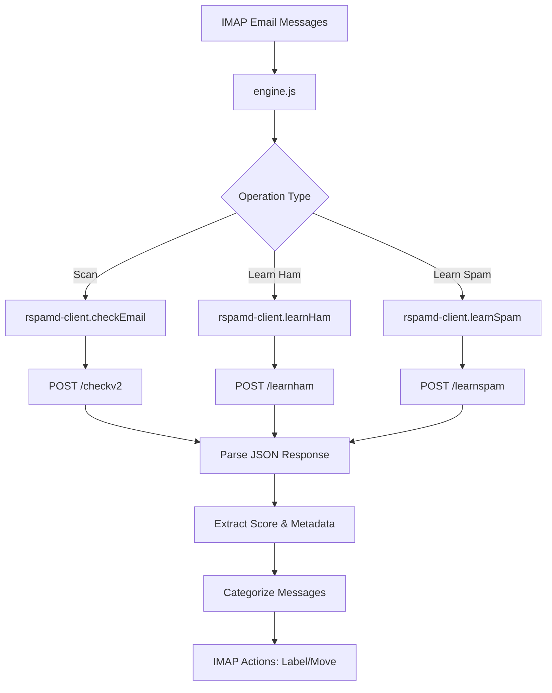

# Replace SpamAssassin with Rspamd

**Status**: Planning  
**Date**: 2026-02-13  
**Complexity**: COMPLEX

## Overview

Complete replacement of SpamAssassin with Rspamd for spam detection and email classification. This change moves from command-line tool integration (spamc, sa-learn) to HTTP API-based integration using fetch/POST requests.

**Context**: The system currently uses SpamAssassin via command-line tools (`spamc` for checking, `sa-learn` for training). Rspamd provides a modern HTTP API with better performance, more flexible configuration, and is already running in Docker. This change will modernize the spam filtering infrastructure.

**Motivation**: 
- Modern HTTP API is more maintainable than CLI subprocess spawning
- Better performance and resource utilization
- Rspamd provides richer spam analysis and scoring
- Docker-based deployment simplifies infrastructure
- Eliminates need for SpamAssassin system dependencies

**Success Criteria**:
- All spam scanning functionality works with Rspamd HTTP API
- Ham/spam training works via Rspamd learning endpoints
- Email classification (low spam, high spam, non-spam) works correctly
- No SpamAssassin code or dependencies remain
- Existing scripts continue to work with minimal changes
- Configuration via environment variables with sensible defaults

---

## Requirements

### Functional Requirements

1. **Spam Scanning**: Check emails for spam using Rspamd `/checkv2` endpoint
2. **Ham Training**: Learn ham (non-spam) emails using Rspamd `/learnham` endpoint
3. **Spam Training**: Learn spam emails using Rspamd `/learnspam` endpoint
4. **Score-based Classification**: Categorize emails as clean, low spam, high spam, or spam based on Rspamd scores
5. **Configuration**: Support configurable Rspamd URL, port, and password via environment variables
6. **Error Handling**: Proper error handling and logging for HTTP requests
7. **Backward Compatibility**: Maintain existing function signatures and return values where possible

### Non-Functional Requirements

- **Performance**: HTTP API should be as fast or faster than subprocess spawning
- **Security**: Support password authentication for Rspamd controller API
- **Scalability**: Connection pooling and proper HTTP client configuration
- **Maintainability**: Clean separation of concerns, clear API integration module

### Constraints & Dependencies

- Rspamd must be running and accessible (Docker Compose configuration exists)
- Node.js built-in `fetch` API (Node 18+)
- Rspamd HTTP API endpoints: `/checkv2`, `/learnham`, `/learnspam`
- Rspamd returns JSON responses with spam scores and metadata
- Must maintain existing IMAP integration and folder processing logic

### Out of Scope

- Whitelist/blacklist functionality (explicitly skipped per requirements)
- SpamAssassin user preferences file manipulation
- Rollback or migration from Rspamd back to SpamAssassin
- Support for both SpamAssassin and Rspamd simultaneously

---

## Architecture

### Current Structure

```
┌─────────────────┐
│  scan-inbox.js  │
│  train-*.js     │
└────────┬────────┘
         │
         ▼
┌─────────────────────────┐
│  spamassassin.js        │
│  - scanInbox()          │
│  - learnFromFolder()    │
│  - learnWhitelist()     │
│  - learnBlacklist()     │
└────────┬────────────────┘
         │
         ▼
┌──────────────────────────┐
│  spawn-async.js          │
│  - spawnAsync()          │
│  - Execute: spamc        │
│  - Execute: sa-learn     │
└──────────────────────────┘
         │
         ▼
┌──────────────────────────┐
│  SpamAssassin CLI        │
│  (system dependency)     │
└──────────────────────────┘
```

**Current Flow**:
1. Scripts call functions in `spamassassin.js`
2. `spamassassin.js` uses `spawnAsync` to execute CLI commands
3. CLI output is parsed (headers for spamc, stdout for sa-learn)
4. Parsed results are used for classification and labeling

### New/Proposed Structure

```
┌─────────────────┐
│  scan-inbox.js  │
│  train-*.js     │
└────────┬────────┘
         │
         ▼
┌─────────────────────────┐
│  engine.js (new)        │
│  - scanInbox()          │
│  - learnFromFolder()    │
└────────┬────────────────┘
         │
         ▼
┌──────────────────────────┐
│  rspamd-client.js (new)  │
│  - checkEmail()          │
│  - learnHam()            │
│  - learnSpam()           │
│  - HTTP fetch requests   │
└──────────┬───────────────┘
         │
         ▼
┌──────────────────────────┐
│  Rspamd HTTP API         │
│  (Docker container)      │
│  /checkv2                │
│  /learnham               │
│  /learnspam              │
└──────────────────────────┘
```

**New Flow**:
1. Scripts call functions in `engine.js` (renamed from spamassassin.js)
2. `engine.js` uses `rspamd-client.js` HTTP client
3. HTTP POST requests to Rspamd endpoints with email content
4. JSON responses are parsed for scores and classification
5. Classification logic remains similar (score-based categorization)

### Data Flow Diagram



---

## Design Decisions

### Architectural Considerations

**HTTP Client Integration**:
- Use Node.js native `fetch` API (available in Node 18+)
- Create dedicated `rspamd-client.js` module for HTTP communication
- Separate concerns: client handles HTTP, main module handles business logic

**Module Structure**:
- Rename `spamassassin.js` → `engine.js` (maintains similar exports)
- Create new `rspamd-client.js` for low-level HTTP API calls
- Maintain existing function signatures where possible for minimal impact on scripts
- Remove `spawn-async.js` dependency from spam detection flow

**Response Parsing**:
- Replace `parseSpamAssassinOutput()` with `parseRspamdOutput()` in email-parser.js
- Parse JSON responses from Rspamd instead of X-Spam-* headers
- Extract score, required threshold, and action from JSON

### Technology Choices

- **HTTP Client**: Node.js native `fetch` API
  - No external dependencies
  - Modern Promise-based API
  - Supports POST with body
  - Native JSON parsing

- **Rspamd API**: Controller API endpoints
  - `/checkv2`: Check email for spam (returns JSON with scores)
  - `/learnham`: Train classifier with ham email
  - `/learnspam`: Train classifier with spam email

- **Configuration**: Environment variables via existing config.js
  - `RSPAMD_URL`: Base URL (default: `http://localhost:11334`)
  - `RSPAMD_PASSWORD`: Optional password for controller API
  - Reuse existing spam threshold and label configuration

### Design Patterns

**Repository Pattern**: `rspamd-client.js` acts as a repository for Rspamd operations, abstracting HTTP details

**Adapter Pattern**: `engine.js` adapts the Rspamd client to match existing IMAP scanner interface

**Dependency Injection**: Configuration injected via environment variables

### Module-Specific Guidelines

- **Node.js Module**: Follow `.github/instructions/nodejs.instructions.md`
  - Use ES6+ modules (import/export)
  - Async/await for asynchronous operations
  - Proper error handling with try/catch
  - Structured logging with Pino
  - Pure functions where possible

- **Documentation**: Follow `.github/instructions/documentation.instructions.md`
  - JSDoc comments for public functions
  - Clear parameter and return type documentation

### Data Models & API Contracts

**Rspamd Check Response** (from `/checkv2`):
```javascript
{
  "action": "reject" | "add header" | "no action" | "greylist" | "rewrite subject",
  "score": 15.5,              // Spam score
  "required_score": 10.0,     // Threshold for spam
  "symbols": {                // Spam tests triggered
    "SYMBOL_NAME": {
      "score": 2.5,
      "description": "Symbol description"
    }
  },
  "messages": [],             // Warning/error messages
  "message-id": "...",        // Email message ID
  "subject": "..."            // Email subject
}
```

**Rspamd Learn Response** (from `/learnham`, `/learnspam`):
```javascript
{
  "success": true,
  "message": "Learned successfully"
}
```

**Internal Spam Info Object** (matches existing structure):
```javascript
{
  score: 15.5,           // Spam score from Rspamd
  required: 10.0,        // Required score for spam action
  level: null,           // Not used (was SpamAssassin X-Spam-Level)
  isSpam: true,          // Based on action and score
  subject: "...",        // Email subject
  date: "2026-02-13"     // Email date
}
```

---

## Technical Details

### Implementation Specifics

**Rspamd Client Functions**:

1. `checkEmail(emailContent)`:
   - POST to `/checkv2` with raw email content
   - Return parsed JSON response

2. `learnHam(emailContent)`:
   - POST to `/learnham` with raw email content
   - Return success/failure

3. `learnSpam(emailContent)`:
   - POST to `/learnspam` with raw email content
   - Return success/failure

**HTTP Request Format**:
```javascript
await fetch(`${RSPAMD_URL}/checkv2`, {
  method: 'POST',
  headers: {
    'Content-Type': 'text/plain',
    ...(password && { 'Password': password })
  },
  body: emailContent  // Raw email including headers
});
```

### Schemas/Configuration

**Environment Variables** (add to `.env.example`):
```bash
# Rspamd Configuration
RSPAMD_URL=http://localhost:11333
RSPAMD_PASSWORD=
```

**Config Object** (add to `src/lib/utils/config.js`):
```javascript
RSPAMD_URL: process.env.RSPAMD_URL || 'http://localhost:11334',
RSPAMD_PASSWORD: process.env.RSPAMD_PASSWORD || ''
```

### API Changes

**No Breaking Changes**: Existing exported functions maintain same signatures:
- `scanInbox(imap)` - unchanged
- `learnFromFolder(imap, type)` - unchanged
- `learnWhitelist(imap)` - REMOVED
- `learnBlacklist(imap)` - REMOVED

**Internal Changes**:
- Replace `processWithSpamc()` → `processWithRspamd()`
- Replace `processWithSALearn()` → `processWithRspamdLearn()`
- Update `parseSpamAssassinOutput()` → `parseRspamdOutput()`

---

## Edge Cases & Considerations

### Known Challenges

1. **Action Mapping**: Rspamd returns actions (reject, add header, no action, etc.) while SpamAssassin returns boolean isSpam
   - **Mitigation**: Map actions to isSpam boolean:
     - "reject", "add header" → isSpam = true
     - "no action", "greylist" → isSpam = false
     - Use score comparison as backup

2. **Score Calculation**: SpamAssassin uses score/required ratio, Rspamd provides both directly
   - **Mitigation**: Use same calculation logic in `spam-classifier.js`, extract score and required_score from Rspamd response

3. **Network Errors**: HTTP requests can fail (timeout, connection refused, etc.)
   - **Mitigation**: Implement retry logic, proper error handling, fallback behavior (skip message and continue)

### Edge Cases

- **Rspamd Not Running**: HTTP connection refused
  - Log error, throw exception, halt processing
  - Clear error message directing to Docker setup

- **Malformed Email**: Rspamd rejects invalid email format
  - Catch parse errors, log with UID, skip message

- **Large Emails**: Size limits may differ from SpamAssassin
  - Rspamd has `max_message` config (default 50MB)
  - Keep existing `--max-size` logic concept in configuration

- **Authentication Required**: Rspamd may require password for learning
  - Support optional password via environment variable
  - Clear error message if authentication fails

### Security Considerations

- **Password Handling**: Store Rspamd password in environment variable, never log it
- **HTTP vs HTTPS**: Default to HTTP for local Docker, support HTTPS URLs for production
- **Input Validation**: Rspamd handles email validation, pass raw content as-is
- **Error Exposure**: Don't expose internal Rspamd errors to IMAP logs, sanitize error messages

### Performance Implications

**Expected Improvements**:
- HTTP requests faster than subprocess spawning
- No shell overhead or process creation
- Connection reuse (keep-alive)
- Parallel processing maintained

**Potential Issues**:
- Network latency (mitigated by local Docker deployment)
- HTTP overhead for small messages (minimal with HTTP/1.1 keep-alive)

**Optimization Opportunities**:
- Reuse fetch connections (automatic with keep-alive)
- Batch learning requests if Rspamd supports it (future enhancement)

---

## Testing Strategy

### Unit Tests

**New Tests** (create `test/rspamd-client.test.js`):
- Mock fetch responses for success/failure scenarios
- Test checkEmail() with various email formats
- Test learnHam() and learnSpam() success and error cases
- Test authentication with and without password
- Test error handling for network failures

**Updated Tests** (update `test/email-parser.test.js`):
- Update tests for `parseRspamdOutput()` function
- Test JSON parsing of Rspamd responses
- Test action-to-isSpam mapping
- Test edge cases (missing fields, malformed JSON)

**Updated Tests** (update `test/spam-classifier.test.js`):
- Ensure classification logic works with Rspamd scores
- Test boundary conditions for score thresholds

### Integration Tests

- **Rspamd Connectivity**: Test connection to Docker Rspamd
- **End-to-End Scanning**: Test full scan workflow with real Rspamd
- **Learning Workflow**: Test ham/spam learning with real emails

### Manual Testing

**Test Scenarios**:
1. Start Rspamd Docker container
2. Run `scan-inbox.js` and verify spam detection
3. Run `train-spam.js` with training emails
4. Run `train-ham.js` with training emails
5. Verify labels applied correctly (Spam:Low, Spam:High)
6. Verify spam moved to spam folder
7. Test with Rspamd not running (error handling)
8. Test with invalid credentials (authentication error)

---

## Success Criteria

- [x] Design document complete and approved
- [ ] Implementation plan created and approved
- [ ] Rspamd client module created and tested
- [ ] Main engine.js module updated
- [ ] Email parser updated for Rspamd responses
- [ ] Configuration added for Rspamd URL and password
- [ ] All existing unit tests pass with updates
- [ ] New unit tests for Rspamd integration pass
- [ ] Manual testing confirms spam scanning works
- [ ] Manual testing confirms ham/spam learning works
- [ ] No SpamAssassin references remain in code
- [ ] spawn-async.js no longer used for spam filtering
- [ ] Documentation updated (README, design docs)
- [ ] Code reviewed and approved

---

## Out of Scope

- Whitelist management (whitelist_from in SpamAssassin user_prefs)
- Blacklist management (blacklist_from in SpamAssassin user_prefs)
- `train-whitelist.js` script functionality
- `train-blacklist.js` script functionality
- Migration of existing SpamAssassin Bayes database to Rspamd
- Support for both SpamAssassin and Rspamd simultaneously
- Rspamd Docker configuration changes
- Advanced Rspamd features (fuzzy hashing, DCC, etc.)
- Rollback or downgrade mechanism

---

## References

- [Rspamd Documentation](https://rspamd.com/doc/)
- [Rspamd HTTP API](https://rspamd.com/doc/architecture/protocol.html)
- [Node.js Instructions](../../.github/instructions/nodejs.instructions.md)
- [Docker Compose Configuration](../../rspamd/docker-compose.yml)
- [Current SpamAssassin Integration](../../src/lib/spamassassin.js)
