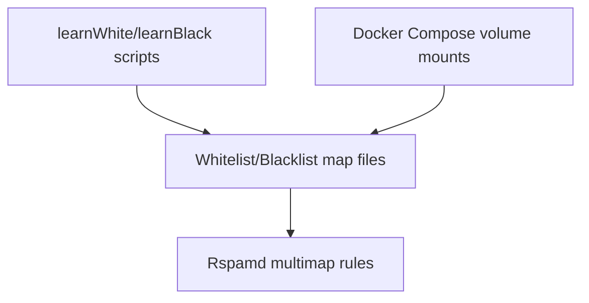

# Rspamd Whitelist/Blacklist Maps

**Status**: Planning | In Development | Under Review | Complete  
**Date**: 2026-02-14  
**Complexity**: COMPLEX

## Overview

Add Rspamd multimap-based whitelist and blacklist support using static email address maps, with application logic to update those files while preserving existing entries.

**Context**: The project is replacing SpamAssassin with Rspamd. We need allow/deny list behavior with strong score adjustments driven by static files that Rspamd auto-reloads.

**Motivation**: Provide deterministic overrides for trusted and blocked senders without retraining or model drift.

**Success Criteria**:
- Whitelist and blacklist email maps are loaded by Rspamd via multimap rules with configurable scores.
- `learnWhite` and `learnBlack` update map files by adding missing emails without removing existing entries.
- Docker Compose mounts map files into the Rspamd container reliably in local dev.

---

## Requirements

### Functional Requirements

1. Add a whitelist multimap that matches explicit email addresses and applies a negative score defined in Rspamd config.
2. Add a blacklist multimap that matches explicit email addresses and applies a positive score defined in Rspamd config.
3. Support map files defined by environment variables (paths relative to repo root), used by application logic and Docker Compose.
4. Implement file update logic in `learnWhite` and `learnBlack` to read existing entries, add new addresses, and preserve existing content.

### Non-Functional Requirements

- **Performance**: File reads/writes are small and infrequent, no impact on scan throughput.
- **Security**: Do not log email contents or sensitive headers; only log address updates with minimal context.
- **Scalability**: Handle hundreds to low thousands of addresses per file without performance issues.
- **Maintainability**: Keep map formats simple (one address per line), document env vars and file locations.

### Constraints & Dependencies

- Rspamd configuration must use `multimap` and local `file://` maps.
- Docker Compose must mount map files into the Rspamd container at paths referenced in config.

### Out of Scope

- Domain wildcards, regexes, or advanced map types.
- UI or API for managing list entries.

---

## Architecture

### Current Structure

```
Application (Node.js) -> Rspamd HTTP API (check)
Rspamd config in rspamd/config
```

### New/Proposed Structure

```
Application (Node.js)
  - Reads env vars for map file paths
  - Updates whitelist/blacklist files

Rspamd
  - multimap rules for whitelist/blacklist
  - file:// maps mounted via Docker Compose
```



---

## Design Decisions

### Architectural Considerations

- Use Rspamd `multimap` with `file://` maps to keep configuration simple and compatible with auto-reload behavior.
- Store map file locations in env vars so scripts and Compose align without hardcoded paths.

### Technology Choices

- **Rspamd multimap**: Native, stable, supports file maps and score adjustments.
- **Static map files**: Easy to edit, version, and mount.

### Design Patterns

- Read-modify-write with de-duplication for map updates.
- Centralized configuration loader for environment-driven paths.

### Module-Specific Guidelines

- Follow `.github/instructions/nodejs.instructions.md` for application logic.
- Follow `.github/instructions/documentation.instructions.md` for docs updates.

### Data Models & API Contracts

```typescript
interface MapUpdateResult {
  added: string[];
  skipped: string[];
  total: number;
}
```

---

## Technical Details

### Implementation Specifics

- Add two map files under `rspamd/maps/` (or chosen location) containing one email per line.
- Add a Rspamd config file that defines two multimap rules:
  - `WHITELIST_EMAIL`: matches `from` against whitelist map, score negative.
  - `BLACKLIST_EMAIL`: matches `from` against blacklist map, score positive.
- Read environment variables to resolve file paths relative to repo root for Node.js scripts.
- `learnWhite`/`learnBlack` load existing map file, normalize entries (trim, lowercase), and append missing ones while preserving order.

### Schemas/Configuration

- Env vars (names to be finalized):
  - `RSPAMD_WHITELIST_MAP_PATH`
  - `RSPAMD_BLACKLIST_MAP_PATH`

### API Changes

- None (internal file updates only).

---

## Edge Cases & Considerations

### Known Challenges

1. Keeping container paths and host paths aligned across dev/prod; mitigate by consistent env vars and Compose mounts.
2. Ensuring map file exists before updates; mitigate by creating file if missing.

### Edge Cases

- Empty map files.
- Duplicate or whitespace-only entries.
- Emails with uppercase characters or surrounding brackets.

### Security Considerations

- Only store email addresses (no full message content).
- Avoid logging full sender lists.

### Performance Implications

- Minimal; file I/O is small and runs during training only.

---

## Testing Strategy

### Unit Tests

- Map file parsing and de-duplication.
- Append behavior for new and existing emails.

### Integration Tests

- `learnWhite` and `learnBlack` update map files and keep existing lines.

### E2E Tests

- Rspamd applies `WHITELIST_EMAIL` and `BLACKLIST_EMAIL` symbols via `checkv2` with a crafted sender.

### Manual Testing

- Add a sender to whitelist map and verify score shift in Rspamd response.

---

## Success Criteria

- [ ] Whitelist and blacklist maps are loaded by Rspamd and affect scoring as configured
- [ ] `learnWhite` and `learnBlack` preserve existing entries and append missing ones
- [ ] Docker Compose mounts map files correctly
- [ ] Documentation updated
- [ ] Code reviewed and approved

---

## Out of Scope

- Domain lists, wildcards, regex, or URL lists
- Dynamic storage (Redis/HTTP maps)

---

## References

- [Rspamd Config](../SPAMASSASSIN.md)
- [Project Structure](../STRUCTURE.md)
