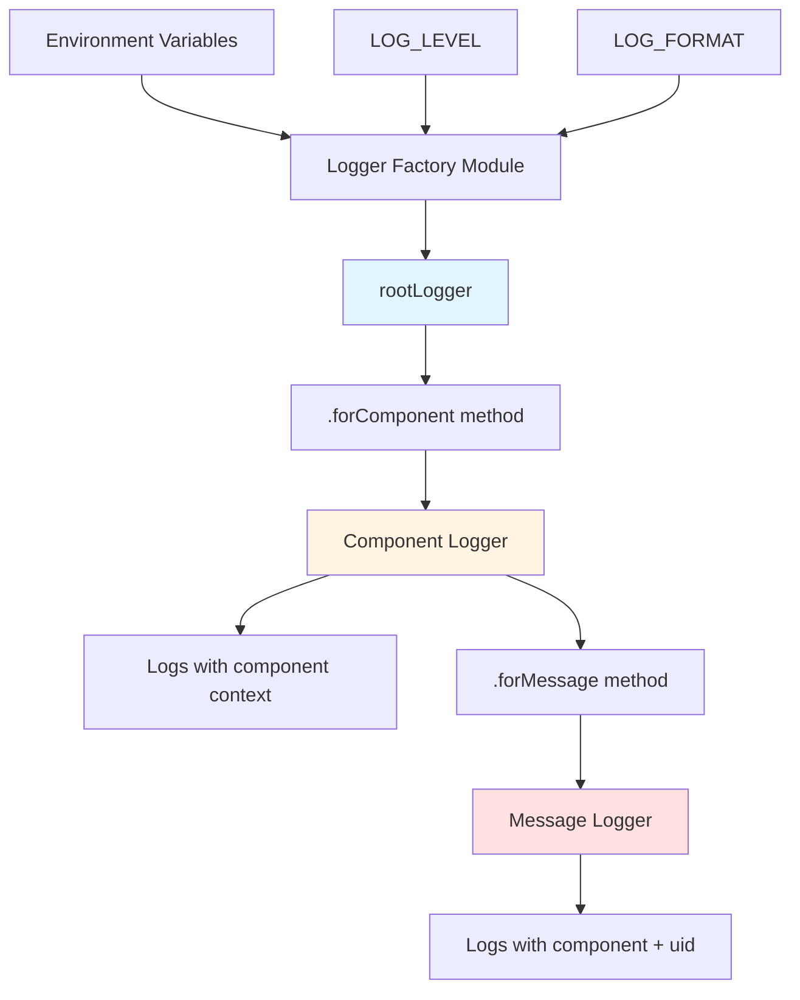

# Centralized Logging System Refactoring

**Status**: Planning  
**Date**: 2026-02-15  
**Complexity**: COMPLEX

## Overview

Refactor the current decentralized logging implementation to use a centralized, configurable logger factory that supports pluggable output formats (human-friendly vs JSONL) and implements correlation IDs using email UIDs to link related log messages together.

**Context**: Currently, Pino logger instances are created independently in 9+ files across the codebase with `const logger = pino()`. This leads to:
- No centralized configuration or consistency
- Inability to switch log output formats without code changes
- UIDs are logged but not used as correlation IDs to link related operations
- No context propagation between related operations
- Difficult to trace message processing flows through the system

**Motivation**: 
- Enable switching between human-readable (development) and JSONL (production) formats via environment variable
- Support correlation IDs to trace email message processing across multiple operations and modules
- Centralize logging configuration for consistency
- Maintain the existing Pino API for all log calls (no breaking changes to developers)
- Improve observability and debugging capabilities

**Success Criteria**:
- Single centralized logger factory module
- All log calls use the same Pino logging API
- Environment variable controls output format (pretty vs JSONL)
- UIDs automatically included in all message-related log entries as correlation IDs
- No changes required to existing logger method calls (logger.info, logger.error, etc.)
- Child logger pattern used for context propagation
- All 9+ files updated to use centralized logger

---

## Requirements

### Functional Requirements

1. **Centralized Logger Factory**: Create a single module that configures and exports the root logger instance
2. **Pluggable Output Format**: Support switching between human-friendly (pino-pretty) and JSONL formats via `LOG_FORMAT` environment variable
3. **Log Level Configuration**: Support `LOG_LEVEL` environment variable (default: 'info')
4. **Correlation ID Pattern**: Automatically include email UID in all related log messages using Pino child loggers
5. **Child Logger API**: Provide helper to create child loggers with UID context
6. **Backward Compatibility**: Maintain existing Pino API for all logger.info, logger.error, logger.debug, logger.warn calls
7. **Default Logger**: Provide a default logger for operations not related to specific messages
8. **Context Propagation**: Functions processing messages should receive or create child loggers with UID context

### Non-Functional Requirements

- **Performance**: Minimal overhead from logging infrastructure; use Pino's efficient bindings
- **Security**: Never log email content or credentials; log UIDs and metadata only
- **Scalability**: Logger must support high-throughput message processing
- **Maintainability**: Clear patterns for when to use child loggers vs default logger
- **Developer Experience**: Logging API remains intuitive; no complex setup per file

### Constraints & Dependencies

- Must use Pino v8.14.1 (existing dependency)
- May use `pino-pretty` for human-friendly output (optional dependency)
- Must work with ES modules (type: "module" in package.json)
- Cannot break existing log calls in 93+ locations
- Must integrate with ImapFlow's logger option (should use loggerForComponent)

### Out of Scope

- Log aggregation or external logging services (Datadog, Splunk, etc.)
- Log file rotation or persistence strategies
- Changing log levels at runtime without restart
- Custom log transports beyond pretty/JSONL
- Redaction of sensitive data (already handled by not logging email content)
- Performance profiling or tracing integration

---

## Architecture

### Current Structure

```
src/
├── lib/
│   ├── imap-client.js          → const logger = pino()
│   ├── rspamd-client.js        → const logger = pino()
│   ├── rspamd.js               → const logger = pino()
│   └── utils/
│       ├── config.js           → const logger = pino()
│       ├── email.js            → const logger = pino()
│       └── rspamd-maps.js      → const logger = pino()
├── init-folders.js             → const logger = pino()
├── list-all.js                 → const logger = pino()
├── read-email.js               → const logger = pino()
└── [9+ files total with independent logger instances]

Issue: No centralization, no format control, UIDs logged but not as correlation IDs
```

### New/Proposed Structure

```
src/
├── lib/
│   ├── utils/
│   │   └── logger.js                 → NEW: Central logger factory
│   ├── imap-client.js                → import { logger } from './utils/logger.js'
│   ├── rspamd-client.js              → import { logger } from './utils/logger.js'
│   ├── rspamd.js                     → import { loggerForMessage } from './utils/logger.js'
│   └── utils/
│       ├── config.js                 → import { logger } from './logger.js'
│       ├── email.js                  → import { logger } from './logger.js'
│       └── rspamd-maps.js            → import { logger } from './logger.js'
├── init-folders.js                   → import { logger } from './lib/utils/logger.js'
├── list-all.js                       → import { logger } from './lib/utils/logger.js'
├── read-email.js                     → import { logger, loggerForMessage } from ...
└── [All files use centralized logger]
```

**Logger Factory Module** (`src/lib/utils/logger.js`):

```javascript
// Exports:
// - rootLogger (base logger for app-level operations)
//   └─ .forComponent(name) → component logger with {component} context
//      └─ .forMessage(uid) → message logger with {component, uid} context

// Strict Hierarchy:
// 1. rootLogger - app-level logs (no context)
// 2. logger = rootLogger.forComponent('rspamd') - component logs {component}
// 3. messageLogger = logger.forMessage(123) - message logs {component, uid}

// Environment Variables:
// - LOG_LEVEL: 'trace' | 'debug' | 'info' | 'warn' | 'error' | 'fatal' (default: 'info')
// - LOG_FORMAT: 'pretty' | 'json' | 'jsonl' (default: 'json')
```



---

## Design Decisions

### Architectural Considerations

1. **Single Source of Truth**: One logger factory module controls all configuration
2. **Lazy Initialization**: Logger configured on first import, respecting environment variables
3. **Strict Hierarchy**: Three-tier explicit logger hierarchy (rootLogger → component → message)
4. **Explicit Declaration**: Component loggers declared once per file with `rootLogger.forComponent('name')`
5. **Context Propagation**: Message loggers created from component logger, ensuring both contexts are always present
6. **ImapFlow Integration**: ImapFlow client configured with `rootLogger.forComponent('imapflow')`

### Technology Choices

- **Pino**: Fast, low-overhead JSON logger (already in use)
  - Rationale: No change needed, already installed, excellent performance
- **pino-pretty** (optional dev dependency): Human-friendly output for development
  - Rationale: Standard Pino companion for pretty logging, well-maintained
- **ES Modules**: Use standard ES6 import/export
  - Rationale: Already used throughout project

### Design Patterns

1. **Factory Pattern**: Logger factory creates configured instances
2. **Singleton Pattern**: Root logger instance is created once and reused
3. **Decorator Pattern**: Child loggers extend root logger with additional context
4. **Context Propagation**: UIDs passed through call chains to maintain correlation

### Module-Specific Guidelines

- Follow `.github/instructions/nodejs.instructions.md`
- Maintain structured logging (JSON format via pino)
- Include relevant context in log messages
- Use appropriate log levels (trace, debug, info, warn, error, fatal)
- Don't log sensitive information (passwords, email content)

### Data Models & API Contracts

**Logger Factory API** (`src/lib/utils/logger.js`):

```javascript
// Create and configure root logger
const pinoLogger = pino(options);

// Attach forComponent method to root logger
pinoLogger.forComponent = function(component) {
  const componentLogger = this.child({ component });
  
  // Attach forMessage method to component logger
  componentLogger.forMessage = function(uid) {
    return this.child({ uid });
  };
  
  return componentLogger;
};

// Export root logger
export const rootLogger = pinoLogger;
```

**Environment Variables**:

```bash
# Log level (default: 'info')
LOG_LEVEL=debug

# Log format (default: 'json')
# Options: 'json', 'jsonl', 'pretty'
LOG_FORMAT=pretty
```

**Usage Patterns**:

```javascript
// Pattern 1: Root logger for app-level operations (no context)
import { rootLogger } from './lib/utils/logger.js';
rootLogger.info('Application started');

// Pattern 2: Component logger (declared once at top of file)
import { rootLogger } from './lib/utils/logger.js';
const logger = rootLogger.forComponent('rspamd');

logger.info('Rspamd initialized');  // {component: 'rspamd'}
logger.debug({url}, 'Connecting to Rspamd');  // {component: 'rspamd', url: '...'}

// Pattern 3: Message logger (created from component logger)
async function processMessage(message) {
  const messageLogger = logger.forMessage(message.uid);
  messageLogger.info('Processing message');  // {component: 'rspamd', uid: 123}
  messageLogger.debug({ score: 5.2 }, 'Spam check completed');  // {component: 'rspamd', uid: 123, score: 5.2}
}

// Pattern 4: Pass message logger through call chain
async function moveMessage(imap, uid, dest, messageLogger) {
  messageLogger.debug({ destFolder: dest }, 'Moving message');  // {component: 'imap', uid: 123, destFolder: '...'}
}
```

---

## Technical Details

### Implementation Specifics

**Logger Factory Implementation** (`src/lib/utils/logger.js`):

1. Read environment variables: `LOG_LEVEL`, `LOG_FORMAT`
2. Configure Pino base options (level, formatters, timestamp)
3. Conditionally add `pino-pretty` transport if `LOG_FORMAT=pretty`
4. Create and export root logger singleton
5. Export helper functions for creating child loggers

**Migration Strategy**:

1. Create `src/lib/utils/logger.js` module with hierarchy support
2. Update all files to import `rootLogger`
3. Add component logger declaration at top of each file: `const logger = rootLogger.forComponent('component-name')`
4. Identify message processing functions and create message loggers: `const messageLogger = logger.forMessage(uid)`
5. Review all 93+ log calls and update to use appropriate logger (rootLogger, logger, or messageLogger)
6. Update ImapFlow client instantiation to use `rootLogger.forComponent('imapflow')`
7. Add tests for logger factory and hierarchy

**Component Name Mapping**:
- `rspamd.js`, `rspamd-client.js` → `'rspamd'`
- `imap-client.js` → `'imap'`
- `rspamd-maps.js` → `'rspamd-maps'`
- `email.js` → `'email-utils'`
- `config.js` → `'config'`
- Scripts: Use descriptive names (`'init-folders'`, `'scan-inbox'`, `'train-spam'`, etc.)

### Schemas/Configuration

**Environment Variables**:

```bash
# .env.example
LOG_LEVEL=info          # trace | debug | info | warn | error | fatal
LOG_FORMAT=json         # json | jsonl | pretty
```

**Pino Configuration** (in logger factory):

```javascript
const options = {
  level: process.env.LOG_LEVEL || 'info',
  formatters: {
    level: (label) => ({ level: label })
  },
  timestamp: pino.stdTimeFunctions.isoTime,
};

// If pretty format requested, add transport
if (process.env.LOG_FORMAT === 'pretty') {
  options.transport = {
    target: 'pino-pretty',
    options: {
      colorize: true,
      translateTime: 'SYS:standard',
      ignore: 'pid,hostname'
    }
  };
}
```

### API Changes

No breaking API changes. All existing logger calls remain unchanged:
- `logger.info(...)` → works as before
- `logger.error(...)` → works as before
- `logger.debug(...)` → works as before

**New Patterns Introduced**:

```javascript
// NEW: Hierarchical logger structure
import { rootLogger } from './lib/utils/logger.js';

// Declare component logger once at file level
const logger = rootLogger.forComponent('rspamd');

// Use component logger for component-level operations
logger.info('Component initialized');

// Create message logger from component logger
const messageLogger = logger.forMessage(message.uid);
messageLogger.info('Processing message');  // Has both component and uid

// Pass message logger through call chains
await moveMessage(imap, uid, dest, messageLogger);
```

---

## Edge Cases & Considerations

### Known Challenges

1. **Passing Context Through Call Chains**: Functions need to receive or create message loggers
   - **Mitigation**: Add optional `messageLogger` parameter to functions; create from component logger if not passed
   
2. **Batch Operations**: Processing multiple messages in parallel, need distinct loggers per message
   - **Mitigation**: Create message logger for each message: `messages.map(msg => logger.forMessage(msg.uid))`

3. **ImapFlow Logger Integration**: ImapFlow needs a component-specific logger
   - **Mitigation**: Use `rootLogger.forComponent('imapflow')` when creating ImapFlow client

4. **Component Name Consistency**: Multiple files may share same component name
   - **Mitigation**: Document component name mapping; same component = same name across files

4. **Module Load Order**: Config module logs during initialization, needs logger before config loaded
   - **Mitigation**: Logger factory should not depend on config module; read ENV vars directly

5. **Test Environment**: Tests may need to mock or configure logger differently
   - **Mitigation**: Logger factory should support programmatic configuration (for tests)

### Edge Cases

- **Empty/Invalid LOG_LEVEL**: Default to 'info', log warning about invalid value
- **Empty/Invalid LOG_FORMAT**: Default to 'json', log warning about invalid value
- **Missing pino-pretty dependency**: If `LOG_FORMAT=pretty` but pino-pretty not installed, fall back to JSON and log error
- **UID is null/undefined**: Child logger should still be created, log without UID context
- **Multiple UIDs in batch operations**: Each message gets its own child logger instance

### Security Considerations

- **No Email Content Logging**: Continue existing practice of not logging raw email content
- **No Credential Logging**: Config module already careful not to log passwords
- **UID Logging**: UIDs are safe to log (numeric identifiers, not PII)
- **Environment Variables**: LOG_LEVEL and LOG_FORMAT are not sensitive

### Performance Implications

- **Pino Performance**: Pino is already highly optimized, no performance degradation expected
- **Child Logger Overhead**: Minimal; Pino child loggers are lightweight
- **Pretty Format Overhead**: pino-pretty adds overhead; recommend JSON for production
- **Batch Processing**: Creating child logger per message has negligible cost

---

## Testing Strategy

### Unit Tests

Create `test/logger.test.js`:

- Test logger factory creates valid Pino instance with `forComponent` method
- Test `rootLogger.forComponent('name')` creates child logger with `{component}` context
- Test component logger has `forMessage` method available
- Test `componentLogger.forMessage(uid)` creates child with both `{component, uid}` contexts
- Test environment variable handling (LOG_LEVEL, LOG_FORMAT)
- Test default values when environment variables not set
- Test invalid environment variable values (fallback behavior)
- Test logger output contains expected fields (timestamp, level, msg)
- Test hierarchy: root → component → message produces correct nested context

### Integration Tests

- Test logger integration with ImapFlow client
- Test message processing with child logger context
- Test batch processing creates distinct loggers per message
- Test log output format switching (JSON vs pretty)

### E2E Tests

Not applicable for logging infrastructure. Verify through:
- Manual testing of log output in different environments
- Reviewing log files from production-like scenarios
- Testing LOG_FORMAT switching with actual application workload

### Manual Testing

**Test Scenarios**:

1. **Default Configuration** (no ENV vars set):
   - Run application, verify JSON output at INFO level
   
2. **Pretty Format** (LOG_FORMAT=pretty):
   - Run application, verify human-readable colored output
   
3. **Debug Level** (LOG_LEVEL=debug):
   - Run application, verify DEBUG messages appear
   
4. **UID Correlation**:
   - Process messages, verify all logs for same message contain same `uid` field
   - Search logs by UID to see complete processing flow

5. **ImapFlow Integration**:
   - Verify ImapFlow logs contain `component: 'imapflow'` field
   - Verify ImapFlow logs integrate with centralized logger

**Verification Checklist**:

- [ ] All 9+ files successfully import centralized logger
- [ ] No more `const logger = pino()` in any source file
- [ ] UIDs appear in all message-related log entries
- [ ] LOG_FORMAT=pretty produces readable output
- [ ] LOG_FORMAT=json produces valid JSONL
- [ ] LOG_LEVEL controls verbosity correctly
- [ ] No breaking changes to existing log calls
- [ ] ImapFlow logger integration still works

---

## Success Criteria

- [x] Design document created and approved
- [ ] Logger factory module created at `src/lib/utils/logger.js`
- [ ] `forComponent` and `forMessage` methods implemented on loggers
- [ ] All 9+ files updated to import `rootLogger` and declare component loggers
- [ ] Environment variables `LOG_LEVEL` and `LOG_FORMAT` implemented
- [ ] Hierarchical logger pattern enforcing component + uid for all message logs
- [ ] `pino-pretty` added as optional dev dependency
- [ ] Unit tests created and passing
- [ ] Manual testing confirms format switching works
- [ ] Documentation updated (.env.example, README)
- [ ] All existing tests still pass
- [ ] Code reviewed and approved

---

## Out of Scope

- Log aggregation or external logging services (Datadog, Splunk, ELK, etc.)
- Log file rotation, archival, or persistence strategies beyond standard output
- Runtime log level changes without application restart
- Custom log transports or formatters beyond pretty/JSONL
- Redaction or filtering of sensitive data (already handled appropriately)
- Performance profiling, tracing, or APM integration (OpenTelemetry, Jaeger, etc.)
- Structured error tracking services (Sentry, Rollbar, etc.)
- Log parsing or analysis tools
- Dashboard or visualization for logs

---

## References

- [Pino Documentation](https://getpino.io/)
- [pino-pretty Documentation](https://github.com/pinojs/pino-pretty)
- [Node.js Instructions](../../.github/instructions/nodejs.instructions.md)
- [Project Structure](../STRUCTURE.md)
