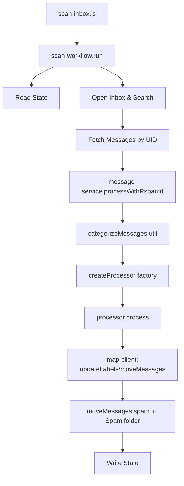
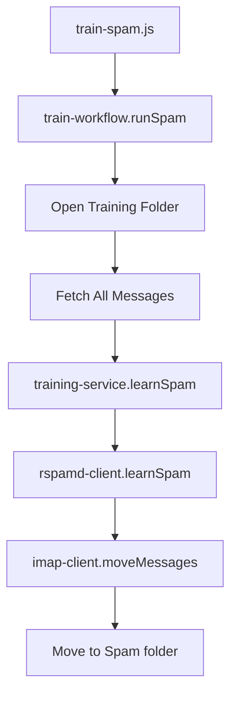
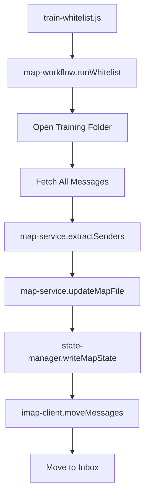

# Source Structure Refactoring

**Status**: Planning  
**Date**: 2026-02-16  
**Complexity**: COMPLEX

## Overview

Comprehensive refactoring of the src directory to improve modularity, extensibility, maintainability, and testability. The current structure has grown organically with all business logic centralized in a monolithic `engine.js` file, making it difficult to test, extend, and maintain as new features are added.

**Context**: The application has evolved from a simple spam scanner to support multiple processing modes (label/folder/color), whitelist/blacklist maps, and various training workflows. The current architecture concentrates all orchestration and business logic in `lib/engine.js` (~400 lines), which violates single responsibility principle and makes testing difficult.

**Motivation**: 
- **Modularity**: Separate scanning, training, and map management into distinct modules with clear boundaries
- **Extensibility**: Strategy pattern for processing modes (label/folder/color); abstraction layer for future spam backends (local/cloud/different engines)
- **Maintainability**: Smaller, focused modules with clear naming and responsibility; easier onboarding for new developers
- **Testing**: Business logic separated from I/O operations; mock-friendly architecture for comprehensive unit test coverage

**Success Criteria**:
- All business logic moved from engine.js into focused service modules
- Processing strategies implemented with strategy pattern (label/folder/color processors)
- Workflows orchestrate services without containing business logic
- Entry scripts remain simple and delegate to workflows
- Existing functionality preserved (no breaking changes)
- Test coverage improved with testable service layer
- Code structure documented and follows project guidelines

---

## Requirements

### Functional Requirements

1. **Preserve All Current Functionality**: No feature regressions or breaking changes
   - Inbox scanning with Rspamd
   - Spam/ham training
   - Whitelist/blacklist map management
   - State persistence
   - All utility scripts continue working

2. **Processing Mode Abstraction**: Implement strategy pattern for processing modes
   - Base processor interface
   - Label processor (current behavior)
   - Folder processor (future: move to folders)
   - Color processor (future: color flags)
   - Factory creates processor based on configuration

3. **Separation of Concerns**: Clear boundaries between layers
   - Workflows: Orchestration only (coordinate services, state, IMAP)
   - Services: Business logic only (pure functions where possible)
   - Clients: External I/O only (IMAP, Rspamd HTTP)
   - Utils: Shared utilities (existing)

4. **Workflow Organization**: Three primary workflow modules
   - Scan workflow: Inbox scanning orchestration
   - Train workflow: Spam/ham training orchestration
   - Map workflow: Whitelist/blacklist orchestration

5. **Entry Point Stability**: Main workflow scripts in src/ root remain as thin entry points
   - Minimal changes to existing entry scripts
   - Delegate to appropriate workflows
   - Maintain CLI interface compatibility

6. **Admin/Utility Scripts Separation**: Move utility scripts to src/admin/ for better organization
   - Separates workflow entry points (src/) from admin/debug tools (src/admin/)
   - read-state.js, write-state.js, delete-state.js, reset-state.js: State management utilities
   - list-all.js, read-email.js, uid-on-date.js: Debugging/inspection utilities
   - init-folders.js remains at src/ root (part of main workflow sequence, called by start.sh)
   - Only import path updates needed (imap-client moves to clients/)

7. **Orchestration Scripts**: Shell scripts in bin/ coordinate workflow execution
   - bin/local/start.sh: Loads .env, runs workflows in sequence (init → train → scan), loops continuously
   - Future: bin/docker/start.sh for containerized deployment (out of scope)

### Non-Functional Requirements

- **Performance**: No performance degradation; maintain existing batch processing efficiency
- **Security**: No security implications; maintain existing authentication and validation
- **Scalability**: Structure supports adding new processing modes and spam backends without core changes
- **Maintainability**: Clear module boundaries, consistent naming, comprehensive inline documentation
- **Backward Compatibility**: Existing configuration and environment variables unchanged

### Constraints & Dependencies

- Node.js ES6+ modules (existing)
- Existing IMAP and Rspamd client interfaces must be preserved
- State management structure remains unchanged
- No changes to external interfaces (IMAP folders, Rspamd API)
- Must follow `.github/instructions/nodejs.instructions.md` guidelines

### Orchestration & Admin Scripts

**bin/local/start.sh** orchestrates the complete workflow:
- **Environment Loading**: Safely parses and loads .env file (handles comments, special characters)
- **Validation**: Checks required variables (IMAP_HOST, IMAP_USER) before starting
- **Sequential Execution**: Runs workflows in optimal order:
  1. `init-folders` - Creates required IMAP folders (first run or folder recovery)
  2. `train-spam` - Learns from spam training folder
  3. `train-ham` - Learns from ham training folder
  4. `train-whitelist` - Updates whitelist map from training folder
  5. `train-blacklist` - Updates blacklist map from training folder
  6. `scan-inbox` - Scans inbox for new messages
- **Continuous Loop**: Repeats sequence with configurable sleep interval (default: 300s)
- **User Control**: Allows skipping sleep by pressing Enter
- **Future**: bin/docker/start.sh for containerized deployment (out of scope)

**src/init-folders.js** plays a critical setup role:
- Creates all required IMAP folders before first use
- Creates training folders: FOLDER_TRAIN_SPAM, FOLDER_TRAIN_HAM, FOLDER_TRAIN_WHITELIST, FOLDER_TRAIN_BLACKLIST
- Creates state folder: FOLDER_STATE
- Creates spam likelihood folders: FOLDER_SPAM_LOW, FOLDER_SPAM_HIGH (when spam likelihood feature implemented)
- Uses `createAppFolders()` from clients/imap-client
- Remains at src/ root (part of main workflow sequence in start.sh)
- Import path updated: `./lib/imap-client.js` → `./lib/clients/imap-client.js`

**Other admin/utility scripts** (src/admin/) provide debugging and inspection:
- **list-all.js**: Lists all messages in a specified folder
- **read-email.js**: Reads and displays a specific email by UID
- **uid-on-date.js**: Finds the UID of the first message on a specific date
- **read-state.js**: Reads and displays scanner state (JSON output)
- **write-state.js**: Writes state from stdin (manual state manipulation)
- **delete-state.js**: Deletes all state data (clean slate)
- **reset-state.js**: Resets scanner state to initial values (last_uid=0)

All admin scripts moved to src/admin/ directory with import paths updated from `./lib/` to `../lib/`.

---

## Out of Scope

- Implementing new processing modes (folder/color) - structure only prepared for them
- Migration to TypeScript (remain with JavaScript)
- Database integration or alternate state storage
- Changes to Rspamd configuration or Docker setup
- Performance optimizations beyond structural improvements
- Changing existing entry script names or CLI interfaces
- Refactoring test files (unless needed for new service tests)

---

## Architecture

### Current Structure (Problems)

```
src/
├── lib/
│   ├── engine.js              ← MONOLITH: All business logic + orchestration
│   │                          ← Contains: scan*, learn*, processWithRspamd, etc.
│   │                          ← ~400 lines mixing concerns
│   ├── imap-client.js         ← IMAP operations
│   ├── rspamd-client.js       ← Rspamd HTTP API
│   ├── state-manager.js       ← State persistence
│   └── utils/                 ← Utility functions (well organized)
│       ├── config.js
│       ├── email-parser.js
│       ├── spam-classifier.js
│       └── [others]
├── scan-inbox.js              ← Entry: calls engine.scanInbox()
├── train-spam.js              ← Entry: calls engine.learnFromFolder('spam')
├── train-ham.js               ← Entry: calls engine.learnFromFolder('ham')
├── train-whitelist.js         ← Entry: calls engine.learnWhitelist()
├── train-blacklist.js         ← Entry: calls engine.learnBlacklist()
└── [utility scripts]
```

**Current Problems**:
1. **engine.js is monolithic**: Contains 4 exported functions with mixed responsibilities
   - `scanInbox()`, `scanMessages()` - scanning orchestration + business logic
   - `learnFromFolder()` - training orchestration + business logic
   - `learnWhitelist()`, `learnBlacklist()` - map management orchestration + business logic
   
2. **No processing abstraction**: Label logic hardcoded in `scanMessages()`
   - Cannot easily switch between label/folder/color modes
   - Adding new modes requires modifying core scanning logic

3. **Business logic + I/O tightly coupled**: Difficult to unit test
   - Rspamd processing mixed with categorization
   - Map updates mixed with file I/O
   - Training logic mixed with IMAP operations

4. **Hard to extend**: Adding new spam backends would require forking engine.js

5. **Testing challenges**: Cannot test business logic without mocking IMAP and Rspamd

### New/Proposed Structure

```
src/
├── lib/
│   ├── workflows/                    ← HIGH-LEVEL ORCHESTRATION
│   │   ├── scan-workflow.js          ← scanInbox: coordinates scan services
│   │   ├── train-workflow.js         ← trainSpam/Ham: coordinates training
│   │   └── map-workflow.js           ← trainWhitelist/Blacklist: map updates
│   │
│   ├── processors/                   ← PROCESSING STRATEGIES (NEW)
│   │   ├── base-processor.js         ← Abstract interface + factory
│   │   ├── label-processor.js        ← Current: apply/remove labels
│   │   ├── folder-processor.js       ← Future: move to folders
│   │   └── color-processor.js        ← Future: color flags
│   │
│   ├── services/                     ← BUSINESS LOGIC (NEW)
│   │   ├── message-service.js        ← Process messages with Rspamd
│   │   ├── training-service.js       ← Training logic (learn spam/ham)
│   │   └── map-service.js            ← Map update logic (extract/update)
│   │
│   ├── clients/                      ← EXTERNAL I/O (MOVED)
│   │   ├── imap-client.js            ← (existing, minimal changes)
│   │   └── rspamd-client.js          ← (existing, minimal changes)
│   │
│   ├── state-manager.js              ← (existing, no changes)
│   │
│   └── utils/                        ← (existing, no changes)
│       ├── config.js
│       ├── email-parser.js
│       ├── spam-classifier.js
│       └── [others]
│
├── scan-inbox.js                     ← MAIN: Entry point for scanning
├── train-spam.js                     ← MAIN: Entry point for spam training
├── train-ham.js                      ← MAIN: Entry point for ham training
├── train-whitelist.js                ← MAIN: Entry point for whitelist
├── train-blacklist.js                ← MAIN: Entry point for blacklist
├── init-folders.js                   ← MAIN: Setup script (creates IMAP folders)
│
└── admin/                            ← ADMIN/UTILITY SCRIPTS (NEW DIR)
    ├── read-state.js                 ← Debug: reads scanner state
    ├── write-state.js                ← Debug: writes scanner state
    ├── delete-state.js               ← Admin: deletes scanner state
    ├── reset-state.js                ← Admin: resets scanner state
    ├── list-all.js                   ← Debug: lists folder messages
    ├── read-email.js                 ← Debug: reads specific email
    └── uid-on-date.js                ← Debug: finds UID by date

bin/
└── local/
    └── start.sh                      ← ORCHESTRATION: runs workflows in sequence
```

**Key Changes**:
1. **workflows/**: Orchestration layer manages flow, coordinates services
2. **processors/**: Strategy pattern for message processing (label/folder/color)
3. **services/**: Pure business logic, testable without I/O
4. **clients/**: Renamed from lib root, grouped external I/O
5. **admin/**: New directory for utility/admin scripts, separated from main workflow entry points
6. **engine.js**: Deleted, logic distributed appropriately
7. **start.sh**: Documented orchestration script that runs workflows in sequence

### Detailed Module Breakdown

#### Workflows (Orchestration)

**scan-workflow.js**:
```javascript
export async function run(imap) {
  // 1. Read state
  // 2. Open inbox, search for new UIDs
  // 3. Process batches:
  //    - messageService.processWithRspamd()
  //    - categorizeMessages() (util)
  //    - processor.process() (strategy)
  //    - moveSpam()
  // 4. Update state
}
```

**train-workflow.js**:
```javascript
export async function runSpam(imap) {
  // 1. Open training folder
  // 2. Fetch messages
  // 3. Process batches:
  //    - trainingService.learnSpam()
  //    - moveMessages()
}

export async function runHam(imap) {
  // Similar to runSpam but for ham
}
```

**map-workflow.js**:
```javascript
export async function runWhitelist(imap) {
  // 1. Open whitelist training folder
  // 2. Fetch messages
  // 3. mapService.extractSenders()
  // 4. mapService.updateMapFile()
  // 5. State backup
  // 6. Move messages
}

export async function runBlacklist(imap) {
  // Similar to runWhitelist
}
```

#### Processors (Strategy Pattern)

**base-processor.js**:
```javascript
// Abstract processor interface
export class BaseProcessor {
  async process(imap, categorizedMessages) {
    throw new Error('Must implement process()');
  }
}

// Factory function
export function createProcessor(mode = 'label') {
  switch (mode) {
    case 'label': return new LabelProcessor();
    case 'folder': return new FolderProcessor();
    case 'color': return new ColorProcessor();
    default: throw new Error(`Unknown mode: ${mode}`);
  }
}
```

**label-processor.js**:
```javascript
export class LabelProcessor extends BaseProcessor {
  async process(imap, {nonSpamMessages, lowSpamMessages, highSpamMessages}) {
    // Apply/remove labels using imap-client
    await updateLabels(imap, nonSpamMessages, [], [LABEL_SPAM_LOW, LABEL_SPAM_HIGH]);
    await updateLabels(imap, lowSpamMessages, [LABEL_SPAM_LOW], [LABEL_SPAM_HIGH]);
    await updateLabels(imap, highSpamMessages, [LABEL_SPAM_HIGH], [LABEL_SPAM_LOW]);
  }
}
```

**folder-processor.js** (future):
```javascript
export class FolderProcessor extends BaseProcessor {
  async process(imap, {nonSpamMessages, lowSpamMessages, highSpamMessages}) {
    // Move to folders
    await moveMessages(imap, lowSpamMessages, config.FOLDER_SPAM_LOW);
    await moveMessages(imap, highSpamMessages, config.FOLDER_SPAM_HIGH);
  }
}
```

**color-processor.js** (future):
```javascript
export class ColorProcessor extends BaseProcessor {
  async process(imap, {nonSpamMessages, lowSpamMessages, highSpamMessages}) {
    // Apply color flags
    await setColorFlag(imap, lowSpamMessages, 'yellow');
    await setColorFlag(imap, highSpamMessages, 'orange');
  }
}
```

#### Services (Business Logic)

**message-service.js**:
```javascript
// Pure business logic for message processing
export async function processWithRspamd(messages) {
  // For each message:
  //   - Call rspamd-client.checkEmail()
  //   - Parse results
  //   - Attach spamInfo to message
  // Return processed messages
}
```

**training-service.js**:
```javascript
// Pure business logic for training
export async function learnSpam(messages) {
  // For each message:
  //   - Call rspamd-client.learnSpam()
  //   - Handle errors
}

export async function learnHam(messages) {
  // Similar to learnSpam
}
```

**map-service.js**:
```javascript
// Pure business logic for map management
export function extractSenders(messages) {
  // Extract sender addresses from message headers
  // Return normalized list
}

export async function updateMapFile(mapPath, senders) {
  // Delegate to rspamd-maps.updateMap()
  // Return update result
}
```

### Data Flow Diagram

**Scanning Flow**:


**Training Flow**:


**Map Flow**:


---

## Design Decisions

### Architectural Considerations

**Layered Architecture**: Three distinct layers with clear responsibilities
- **Workflows**: High-level orchestration, coordinates services and I/O
- **Services**: Pure business logic, minimal dependencies, highly testable
- **Clients**: External I/O boundaries (IMAP, HTTP)

**Strategy Pattern for Processors**: Enables switching processing modes without changing core logic
- Base interface defines contract
- Concrete implementations (label/folder/color)
- Factory creates appropriate processor from config
- Workflow uses processor abstraction, unaware of implementation

**Service Layer Benefits**:
- Pure functions are unit testable without mocks (e.g., extractSenders)
- Functions with I/O tested via manual integration testing
- Can be reused across different workflows
- Clear inputs and outputs

**Workflow as Coordinator**: Thin orchestration layer
- No business logic or complex algorithms
- Delegates to services for logic
- Manages state persistence
- Handles IMAP session management
- Coordinates batch processing

### Technology Choices

- **Node.js ES6+ Modules**: Continue using existing module system
- **Existing Dependencies**: No new dependencies required
- **Pino Logger**: Maintain structured logging throughout
- **Vitest**: Continue for testing, add service layer tests

### Design Patterns

**Strategy Pattern**: Processors implement different processing modes
- Interface: BaseProcessor with `process()` method
- Concrete strategies: LabelProcessor, FolderProcessor, ColorProcessor
- Client: Workflow uses processor abstraction

**Factory Pattern**: `createProcessor(mode)` creates appropriate processor
- Centralized creation logic
- Easy to extend with new processors
- Config-driven instantiation

**Service Layer Pattern**: Business logic in services
- Thin workflows delegate to services
- Services are stateless (where possible)
- Clear separation of concerns

**Dependency Injection**: Workflows receive IMAP client and config
- No global state
- Easier to test
- Clear dependencies

### Module-Specific Guidelines

- Follow `.github/instructions/nodejs.instructions.md`
- ES6+ syntax (const/let, arrow functions, async/await)
- Structured logging with Pino
- Proper error handling with try-catch
- Small, focused functions
- Meaningful names

### Data Models & API Contracts

**Workflow Interface** (consistent across all workflows):
```javascript
// scan-workflow.js
export async function run(imap: ImapClient): Promise<void>

// train-workflow.js
export async function runSpam(imap: ImapClient): Promise<void>
export async function runHam(imap: ImapClient): Promise<void>

// map-workflow.js
export async function runWhitelist(imap: ImapClient): Promise<void>
export async function runBlacklist(imap: ImapClient): Promise<void>
```

**Processor Interface**:
```javascript
export class BaseProcessor {
  async process(
    imap: ImapClient,
    categorized: {
      nonSpamMessages: Message[],
      lowSpamMessages: Message[],
      highSpamMessages: Message[]
    }
  ): Promise<void>
}
```

**Service Contracts**:
```javascript
// message-service.js
export async function processWithRspamd(
  messages: Message[]
): Promise<MessageWithSpamInfo[]>

// training-service.js
export async function learnSpam(messages: Message[]): Promise<void>
export async function learnHam(messages: Message[]): Promise<void>

// map-service.js
export function extractSenders(messages: Message[]): string[]
export async function updateMapFile(
  mapPath: string,
  senders: string[]
): Promise<UpdateResult>
```

**Message Types** (existing, documented here):
```javascript
// Base message from IMAP
interface Message {
  uid: number;
  envelope: Envelope;
  headers: Headers;
  raw: Buffer;
}

// After Rspamd processing
interface MessageWithSpamInfo extends Message {
  spamInfo: {
    score: number;
    required: number;
    level: string;
    isSpam: boolean;
    subject: string;
    date: string;
  }
}

// After categorization
interface CategorizedMessages {
  nonSpamMessages: MessageWithSpamInfo[];
  lowSpamMessages: MessageWithSpamInfo[];
  highSpamMessages: MessageWithSpamInfo[];
  spamMessages: MessageWithSpamInfo[];
}
```

---

## Technical Details

### Implementation Specifics

**Phase 1: Create New Structure** (non-breaking)
- Create `lib/workflows/`, `lib/processors/`, `lib/services/`, `lib/clients/` directories
- Move `imap-client.js` and `rspamd-client.js` to `lib/clients/`
- Create base-processor.js with abstract class and factory
- Create label-processor.js (extract from engine.js)
- Create message-service.js (extract from engine.js)
- Create training-service.js (extract from engine.js)
- Create map-service.js (extract from engine.js)
- Create scan-workflow.js (refactor from engine.scanInbox)
- Create train-workflow.js (refactor from engine.learnFromFolder)
- Create map-workflow.js (refactor from engine.learnWhitelist/Blacklist)

**Phase 2: Update Entry Scripts**
- Update scan-inbox.js to use scan-workflow
- Update train-spam.js to use train-workflow.runSpam
- Update train-ham.js to use train-workflow.runHam
- Update train-whitelist.js to use map-workflow.runWhitelist
- Update train-blacklist.js to use map-workflow.runBlacklist

**Phase 2b: Reorganize Admin/Utility Scripts**
- Create src/admin/ directory
- Move admin/utility scripts to src/admin/:
  - read-state.js → admin/read-state.js
  - write-state.js → admin/write-state.js
  - delete-state.js → admin/delete-state.js
  - reset-state.js → admin/reset-state.js
  - list-all.js → admin/list-all.js
  - read-email.js → admin/read-email.js
  - uid-on-date.js → admin/uid-on-date.js
- Update import paths in moved scripts:
  - `./lib/imap-client.js` → `../lib/clients/imap-client.js`
  - `./lib/state-manager.js` → `../lib/state-manager.js`
  - `./lib/utils/config.js` → `../lib/utils/config.js`
- Update init-folders.js (stays at src/ root):
  - `./lib/imap-client.js` → `./lib/clients/imap-client.js`

**Phase 3: Cleanup**
- Delete engine.js (all logic migrated)
- Update any internal imports that referenced engine.js
- Update documentation

**Phase 4: Testing**
- Add unit tests for pure logic (map-service.extractSenders, processor factory)
- Existing util tests remain unchanged
- Comprehensive manual integration testing for workflows, services with I/O, and client operations

### File-by-File Mapping

**Current → New**:

`lib/engine.js` → Distributed:
- `scanInbox()` → `workflows/scan-workflow.js::run()`
- `scanMessages()` → `workflows/scan-workflow.js::scanBatch()` + services
- `processWithRspamd()` → `services/message-service.js::processWithRspamd()`
- `learnFromFolder()` → `workflows/train-workflow.js::runSpam()` / `::runHam()`
- `train()` → `services/training-service.js::learnSpam()` / `::learnHam()`
- `learnWhitelist()` → `workflows/map-workflow.js::runWhitelist()`
- `learnBlacklist()` → `workflows/map-workflow.js::runBlacklist()`
- `learnFromMap()` → `workflows/map-workflow.js::runMap()` + services
- Label operations → `processors/label-processor.js::process()`

`lib/imap-client.js` → `lib/clients/imap-client.js` (moved)

`lib/rspamd-client.js` → `lib/clients/rspamd-client.js` (moved)

**Main Workflow Scripts** → Import paths updated:
- `src/init-folders.js`: Update import from `./lib/imap-client.js` to `./lib/clients/imap-client.js` (stays at src/ root)

**Admin/Utility Scripts** → Moved to src/admin/ with updated imports:

- `src/list-all.js` → `src/admin/list-all.js`
- `src/read-email.js` → `src/admin/read-email.js`
- `src/uid-on-date.js` → `src/admin/uid-on-date.js`
- `src/read-state.js` → `src/admin/read-state.js`
- `src/write-state.js` → `src/admin/write-state.js`
- `src/delete-state.js` → `src/admin/delete-state.js`
- `src/reset-state.js` → `src/admin/reset-state.js`

All imports updated from `./lib/` to `../lib/` due to new directory depth.

**Note**: init-folders.js stays at src/ root (not moved to admin/) as it's part of the main workflow sequence.

### Configuration Changes

**New environment variable** (optional):
```bash
SPAM_PROCESSING_MODE=label  # Options: label | folder | color
```

**config.js additions**:
```javascript
SPAM_PROCESSING_MODE: process.env.SPAM_PROCESSING_MODE || 'label',
```

### Import Path Updates

**Entry scripts** (e.g., scan-inbox.js):
```javascript
// OLD
import { scanInbox } from './lib/engine.js';

// NEW
import { run as scanInbox } from './lib/workflows/scan-workflow.js';
```

**Services importing clients**:
```javascript
// OLD
import { checkEmail, learnSpam } from './rspamd-client.js';

// NEW
import { checkEmail, learnSpam } from '../clients/rspamd-client.js';
```

**Utility scripts** (e.g., admin/read-state.js):
```javascript
// OLD (at src/read-state.js)
import { readScannerState } from './lib/state-manager.js';

// NEW (at src/admin/read-state.js)
import { readScannerState } from '../lib/state-manager.js';
import { rootLogger } from '../lib/utils/logger.js';
import { config } from '../lib/utils/config.js';
```

**Main workflow script** (init-folders.js stays at src/ root):
```javascript
// OLD (at src/init-folders.js)
import { createAppFolders, newClient } from './lib/imap-client.js';

// NEW (at src/init-folders.js)
import { createAppFolders, newClient } from './lib/clients/imap-client.js';
import { rootLogger } from './lib/utils/logger.js';
import { config } from './lib/utils/config.js';
```

---

## Edge Cases & Considerations

### Known Challenges

1. **Circular Dependencies**: Avoid cycles between workflows, services, and clients
   - **Mitigation**: Clear layering (workflows → services → clients), no upward dependencies

2. **State Management Across Workflows**: State manager currently used by engine.js
   - **Mitigation**: Workflows import state-manager directly (stays at lib root)

3. **Logging Context**: Need consistent logging across new modules
   - **Mitigation**: Each module gets component logger: `rootLogger.forComponent('scan-workflow')`

4. **Error Propagation**: Errors must bubble up through layers properly
   - **Mitigation**: All async functions propagate errors; workflows catch and log

5. **Testing Existing Functionality**: Must verify no regressions
   - **Mitigation**: Manual testing checklist; existing tests continue to pass

### Edge Cases

- **Empty Message Batches**: Services handle empty arrays gracefully
- **Missing Processor Mode**: Factory throws clear error for unknown mode
- **IMAP Connection Loss**: Workflows handle same as current engine.js
- **Rspamd Unavailable**: Services propagate errors to workflows for handling

### Security Considerations

- **No Security Changes**: Same authentication and validation as current
- **Credentials**: Remain in environment variables, accessed via config
- **Email Content**: Same handling as current (not logged, properly parsed)

### Performance Implications

**No Performance Degradation Expected**:
- Same batch processing logic (moved, not changed)
- Same IMAP operations (same client functions)
- Same Rspamd calls (same client functions)
- Additional function calls negligible overhead (~1-2% max)

**Potential Benefits**:
- More targeted async operations in service layer
- Possibility of future caching in services

---

## Testing Strategy

### Unit Tests

**Philosophy**: Test pure logic without mocks; manual testing covers client integrations.

**New service tests** (pure logic only):
- `test/map-service.test.js`: Test `extractSenders()` pure function
  - Input: message objects with headers
  - Output: normalized sender email addresses
  - No external dependencies, fully testable

**New processor tests** (factory and interface):
- `test/base-processor.test.js`: Test processor factory logic
  - Test `createProcessor('label')` returns LabelProcessor instance
  - Test `createProcessor('folder')` returns FolderProcessor instance
  - Test `createProcessor('invalid')` throws error
  - Test abstract BaseProcessor throws on direct use
  - No mocking needed - tests instantiation and error handling

**Existing tests**:
- `test/spam-classifier.test.js`: No changes (utils unchanged)
- `test/email-parser.test.js`: No changes
- `test/email.test.js`: No changes
- `test/logger.test.js`: No changes
- `test/mailboxes-utils.test.js`: No changes
- `test/rspamd-maps.test.js`: No changes
- Other util tests: No changes

**Not tested via unit tests** (covered by manual integration testing):
- `message-service.processWithRspamd()` - requires Rspamd client (manual test)
- `training-service.learnSpam/Ham()` - requires Rspamd client (manual test)
- `map-service.updateMapFile()` - requires file I/O (manual test)
- Processor `process()` methods - require IMAP client (manual test)
- Workflows - orchestration tested manually

### Integration Tests

**Manual integration testing** (required before approval):
1. **Scanning**: Run scan-inbox.js, verify messages processed correctly
2. **Training - Spam**: Run train-spam.js, verify Rspamd learning and moves
3. **Training - Ham**: Run train-ham.js, verify Rspamd learning and moves
4. **Whitelist**: Run train-whitelist.js, verify map updates and moves
5. **Blacklist**: Run train-blacklist.js, verify map updates and moves
6. **State**: Verify state persistence across all workflows
7. **Labels**: Verify label application in scanning (default mode)

### Manual Testing Checklist

**Orchestration**:
- [ ] bin/local/start.sh loads .env correctly
- [ ] bin/local/start.sh runs workflows in correct sequence
- [ ] bin/local/start.sh loops continuously

**Main Workflow Scripts**:
- [ ] init-folders.js creates all folders
- [ ] scan-inbox.js processes new messages
- [ ] Messages categorized correctly (clean/low/high/spam)
- [ ] Labels applied correctly (Spam:Low, Spam:High)
- [ ] Spam moved to Spam folder
- [ ] State updated (last_uid, last_checked)
- [ ] train-spam.js learns spam and moves to Spam
- [ ] train-ham.js learns ham and moves to Inbox
- [ ] train-whitelist.js updates whitelist map and moves to Inbox
- [ ] train-blacklist.js updates blacklist map and moves to Spam
- [ ] Map state backup written correctly
- [ ] Error handling works (disconnect, Rspamd down, etc.)
- [ ] Logging output remains consistent

**Admin Scripts** (src/admin/):
- [ ] admin/list-all.js lists messages
- [ ] admin/read-email.js reads specific email
- [ ] admin/uid-on-date.js finds UID by date
- [ ] admin/read-state.js reads state
- [ ] admin/write-state.js writes state
- [ ] admin/delete-state.js deletes state
- [ ] admin/reset-state.js resets state

---

## Success Criteria

- [ ] Design document complete and approved
- [ ] Implementation plan created and approved
- [ ] All workflows created and tested (scan, train, map)
- [ ] All services created (message, training, map)
- [ ] All processors created (base, label; folder/color stubs)
- [ ] Clients moved to clients/ directory
- [ ] Entry scripts updated to use workflows
- [ ] init-folders.js import paths updated (stays at src/ root)
- [ ] Admin scripts moved to src/admin/ with updated imports
- [ ] engine.js deleted
- [ ] All existing tests pass
- [ ] New unit tests added for pure functions (map-service.extractSenders, processor factory)
- [ ] Comprehensive manual integration testing completed successfully
- [ ] No regressions in functionality
- [ ] Documentation updated (STRUCTURE.md, inline comments)
- [ ] Code reviewed and approved
- [ ] Complexity assessment shows improved maintainability

---

## Out of Scope

- **Implementing Folder/Color Processors**: Structure prepared, implementation future work
- **TypeScript Migration**: Remain with JavaScript
- **Performance Optimizations**: Beyond structural improvements
- **Changing External Interfaces**: IMAP folders, Rspamd config unchanged
- **Database Integration**: State remains IMAP-based
- **Test File Refactoring**: Unless needed for new service tests
- **CI/CD Pipeline Changes**: Out of scope
- **Docker Configuration**: No changes to rspamd/ or Dockerfile
- **Entry Script Renaming**: Names stay the same
- **Configuration Format Changes**: Environment variables unchanged (except optional SPAM_PROCESSING_MODE)
- **bin/docker/start.sh**: Future containerized orchestration script (mentioned for context)

---

## References

- [Node.js Instructions](../../.github/instructions/nodejs.instructions.md)
- [Current Structure Documentation](../STRUCTURE.md)
- [Spam Likelihood Design](./20260215-spam-likelihood-folders-design.md)
- [Rspamd Integration Design](./20260213-replace-spamassassin-with-rspamd-design.md)
- [Current engine.js](../../src/lib/engine.js)
- [Current imap-client.js](../../src/lib/imap-client.js)
- [Spam Classifier Util](../../src/lib/utils/spam-classifier.js)
