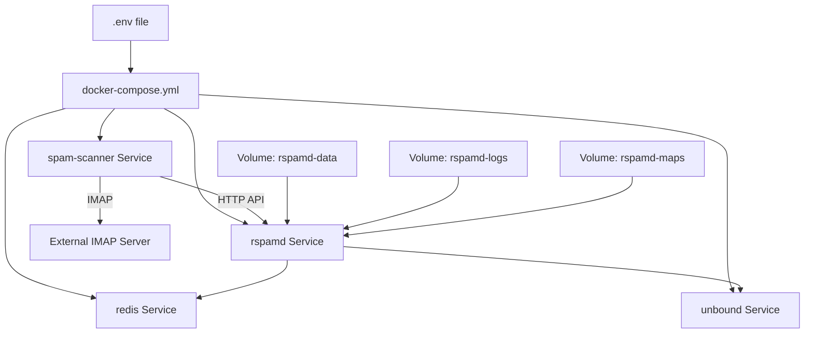

# Docker Containerization for Production Deployment

**Status**: Planning  
**Date**: 2026-02-18  
**Complexity**: COMPLEX

## Overview

Create a production-ready Docker image and docker-compose configuration for the spam-scanner application with integrated Rspamd service.

**Context**: Currently, the application runs directly via Node.js with a local Rspamd instance for development. There's no standardized deployment mechanism for production environments. The bin/local/start.sh script loads .env files manually, which doesn't align with Docker's environment variable handling.

**Motivation**: 
- Enable consistent, reproducible deployments across environments
- Simplify production setup with single docker-compose command
- Isolate dependencies and runtime environment
- Provide a publicly shareable deployment configuration
- Improve operational maintainability

**Success Criteria**:
- Docker image builds successfully with minimal size
- docker-compose.yml deploys both spam-scanner and Rspamd services
- Application connects to Rspamd and processes emails correctly
- Environment variables are properly configured via docker-compose
- Volume mounts preserve Rspamd data, logs, and map files
- Entry point script runs the same script sequence as bin/local/start.sh
- Logs are accessible outside containers

---

## Requirements

### Functional Requirements

1. **Docker Image**: Build a production-ready Docker image for the spam-scanner application
2. **All-in-One Compose**: Single docker-compose.yml in root that deploys spam-scanner, Rspamd, Redis, and Unbound
3. **Entry Point**: Container entry point that runs the same script sequence as bin/local/start.sh (init-folders → train-* → scan-inbox)
4. **Environment Configuration**: Support environment variables via .env file or docker-compose env_file directive
5. **Data Persistence**: Volume mounts for Rspamd data, logs, maps, and state
6. **Inter-Service Communication**: Network configuration for spam-scanner to communicate with Rspamd

### Non-Functional Requirements

- **Performance**: Image size under 200MB (using Alpine base), build time under 3 minutes
- **Security**: 
  - No secrets baked into image
  - Run as non-root user where possible
  - Use official base images with security updates
- **Scalability**: Single-instance deployment (horizontal scaling out of scope)
- **Maintainability**: 
  - Clear Dockerfile with comments
  - Simple, readable entry point scripts
  - Standard Docker best practices

### Constraints & Dependencies

- Must use Node.js v20 or higher (as per package.json engines recommendation)
- Must integrate with existing Rspamd Docker configuration (rspamd/docker-compose.yml as reference)
- Must preserve existing local development workflow (bin/local/start.sh still works)
- Environment variables defined in .env.example must be supported
- IMAP credentials must remain in .env (not committed to git)

### Out of Scope

- Kubernetes deployment manifests
- Multi-stage CI/CD pipeline integration
- Horizontal scaling or load balancing
- Built-in email server (IMAP host is external)
- Automated backup/restore mechanisms
- Health check endpoints in application code
- Monitoring/alerting integration (Prometheus, Grafana)

---

## Architecture

### Current Structure

```
spam-scanner/
├── bin/local/start.sh          # Loads .env, runs scripts in loop
├── rspamd/
│   └── docker-compose.yml      # Local dev Rspamd instance
├── src/
│   ├── init-folders.js
│   ├── train-*.js
│   └── scan-inbox.js
├── .env                         # Environment configuration
└── package.json
```

**Current workflow**:
1. Developer starts Rspamd: `cd rspamd && docker-compose up -d`
2. Developer runs start.sh: `./bin/local/start.sh` (loads .env, runs scripts)

### New/Proposed Structure

```
spam-scanner/
├── Dockerfile                   # Multi-stage build for spam-scanner
├── docker-compose.yml           # All-in-one deployment (root)
├── .dockerignore                # Exclude dev files from build
├── bin/
│   ├── docker/
│   │   └── entrypoint.sh        # Container entry point (NEW)
│   └── local/
│       └── start.sh             # Unchanged
├── rspamd/
│   └── docker-compose.yml       # Keep for local dev reference
└── .env                          # Used by both local and Docker
```

**Proposed workflow**:

**Local Development** (unchanged):
```bash
cd rspamd && docker-compose up -d
./bin/local/start.sh
```

**Production Deployment**:
```bash
docker-compose up -d  # Root docker-compose.yml
```



---

## Design Decisions

### Architectural Considerations

1. **All-in-One Deployment**: Include Rspamd as a service in the same docker-compose.yml
   - **Rationale**: Simplifies production deployment, ensures version compatibility, reduces external dependencies
   - Alternative rejected: External Rspamd (adds operational complexity)

2. **Multi-Stage Docker Build**: Use builder stage for dependencies, runtime stage for execution
   - **Rationale**: Optimizes image size by excluding devDependencies and build tools
   - Alternative rejected: Single-stage build (larger image, includes unnecessary files)

3. **Separate Entry Points**: Keep bin/local/start.sh and bin/docker/entrypoint.sh independent
   - **Rationale**: Logic is simple enough (~30 lines), no significant maintenance burden from duplication
   - Alternative rejected: Shared script (added complexity for minimal benefit)

### Technology Choices

- **Base Image**: `node:20-alpine`
  - **Rationale**: Official Node.js image, Alpine for minimal size (~40MB base), security updates maintained
  - Alternative: `node:20-slim` (Debian-based, larger but broader compatibility)

- **Rspamd Image**: `rspamd/rspamd:latest` (from existing rspamd/docker-compose.yml)
  - **Rationale**: Official image, well-maintained, proven in current local setup

- **Redis Image**: `redis:alpine`
  - **Rationale**: Minimal size, matches existing configuration

- **DNS Image**: `klutchell/unbound:latest`
  - **Rationale**: Matches existing configuration, provides DNS resolution for Rspamd

### Design Patterns

- **Composition**: docker-compose orchestrates multiple services
- **Layered Caching**: Optimize Dockerfile layer order (dependencies before source code)
- **Fail-Fast**: Entry point validates required environment variables before starting

### Module-Specific Guidelines

- Follow `.github/instructions/nodejs.instructions.md` for Node.js code
- Follow `.github/instructions/scripts.instructions.md` for shell scripts
- Follow `.github/instructions/documentation.instructions.md` for README updates

### Data Models & API Contracts

**Volume Mounts**:
```yaml
volumes:
  rspamd-data:        # /var/lib/rspamd (Bayes database, statistics)
  rspamd-logs:        # /var/log/rspamd (Rspamd logs)
  rspamd-maps:        # /etc/rspamd/maps (whitelist.map, blacklist.map)
  redis-data:         # /data (Redis persistence)
```

**Environment Variables** (passed via .env → docker-compose → container):
- IMAP_* (credentials, connection settings)
- FOLDER_* (IMAP folder paths)
- SCAN_* (scanning configuration)
- LOG_* (logging configuration)

**Note**: RSPAMD_URL is hardcoded in docker-compose.yml for internal service communication

**Network**:
- Internal bridge network for service-to-service communication
- RSPAMD_URL defaults to `http://rspamd:11334` (internal service name)

---

## Technical Details

### Implementation Specifics

#### 1. Dockerfile Structure

```dockerfile
# Stage 1: Builder
FROM node:20-alpine AS builder
WORKDIR /app
COPY package*.json ./
RUN npm ci --only=production

# Stage 2: Runtime
FROM node:20-alpine
WORKDIR /app
COPY --from=builder /app/node_modules ./node_modules
COPY src ./src
COPY bin/docker ./bin/docker
ENTRYPOINT ["/app/bin/docker/entrypoint.sh"]
```

**Key points**:
- Use multi-stage build to exclude devDependencies
- Copy only necessary files (src, scripts, entry point)
- Use ENTRYPOINT (not CMD) for proper signal handling

#### 2. .dockerignore

Exclude development and build artifacts:
```
node_modules
.env
.env.*
rspamd/data
rspamd/logs
test
docs
.git
.github
*.md
!README.md
```

#### 3. docker-compose.yml (Root)

Based on rspamd/docker-compose.yml with added spam-scanner service:

```yaml
version: '3.8'

services:
  spam-scanner:
    build: .
    container_name: spam-scanner
    env_file: .env
    depends_on:
      - rspamd
    restart: unless-stopped
    environment:
      - RSPAMD_URL=http://rspamd:11334
      - RSPAMD_PASSWORD=${RSPAMD_PASSWORD}
    networks:
      - spam-network

  rspamd:
    image: rspamd/rspamd:latest
    container_name: rspamd
    ports:
      - "11334:11334"  # Web interface (expose for debugging)
    volumes:
      - ./rspamd/config:/etc/rspamd/local.d
      - rspamd-data:/var/lib/rspamd
      - rspamd-logs:/var/log/rspamd
      - ./rspamd/maps:/etc/rspamd/maps
    depends_on:
      - redis
      - unbound
    restart: unless-stopped
    networks:
      - spam-network

  redis:
    image: redis:alpine
    container_name: rspamd-redis
    volumes:
      - redis-data:/data
    restart: unless-stopped
    networks:
      - spam-network

  unbound:
    image: klutchell/unbound:latest
    container_name: rspamd-unbound
    restart: unless-stopped
    networks:
      - spam-network

volumes:
  rspamd-data:
  rspamd-logs:
  redis-data:

networks:
  spam-network:
    driver: bridge
```

#### 4. Entry Point Script (bin/docker/entrypoint.sh)

```bash
#!/bin/sh
set -e

# Default sleep interval
SLEEP=${SCAN_INTERVAL:-300}

# Validate required environment variables
if [ -z "$IMAP_HOST" ]; then
    echo "Error: IMAP_HOST environment variable is not set!"
    exit 1
fi

echo "Starting spam-scanner..."
echo "Connecting to IMAP: $IMAP_HOST as $IMAP_USER"
echo "Rspamd URL: ${RSPAMD_URL:-http://rspamd:11334}"

# Array of scripts to run
scripts="init-folders train-spam train-ham train-whitelist train-blacklist scan-inbox"

run_script() {
    script_name="$1"
    echo "Running $script_name..."
    node "/app/src/$script_name.js"
}

# Main loop
while true; do
    echo "Starting spam scanner sequence..."
    
    for script in $scripts; do
        run_script "$script"
    done
    
    echo "Spam scanner sequence completed."
    echo "Waiting for $SLEEP seconds..."
    sleep $SLEEP
done
```

### Configuration Changes

**Update .env.example**:
- Add comment that RSPAMD_URL is only used for local development (Docker sets it automatically)
- Document that RSPAMD_PASSWORD is still needed in .env for Docker deployment
- Add note about using .env with docker-compose

**Update README.md**:
- Add "Docker Deployment" section
- Document docker-compose usage
- Explain volume persistence
- Document how to view logs: `docker-compose logs -f spam-scanner`

---

## Edge Cases & Considerations

### Known Challenges

1. **Signal Handling in Containers**
   - **Challenge**: Docker sends SIGTERM to PID 1; shell scripts may not propagate signals correctly
   - **Mitigation**: Use `exec` in entry point to replace shell with process, use `set -e` for error propagation

2. **Volume Permissions**
   - **Challenge**: Rspamd container may run as specific UID/GID, causing permission issues with mounted volumes
   - **Mitigation**: Use named volumes (not bind mounts) for data, allow Docker to manage permissions

3. **First-Time Setup**
   - **Challenge**: Users need to create .env with credentials before first run
   - **Mitigation**: Clear documentation in README, docker-compose will fail fast with error message if IMAP_HOST missing

### Edge Cases

- **Empty Rspamd Maps**: First run with no whitelist/blacklist maps
  - Handle gracefully (maps can be empty files)
  
- **IMAP Connection Failure**: External IMAP server unreachable
  - Application should log error and retry on next cycle (existing behavior)

- **Rspamd Not Ready**: spam-scanner starts before Rspamd is fully initialized
  - Use `depends_on` for ordering, application should handle connection errors gracefully

- **Log Rotation**: Docker logs can grow unbounded
  - Document use of Docker logging drivers (json-file with max-size/max-file)

### Security Considerations

- **Secrets Management**: 
  - .env file contains IMAP_PASSWORD and RSPAMD_PASSWORD
  - Must NOT be committed to git (.gitignore already configured)
  - Consider Docker secrets for production (future enhancement)

- **Network Exposure**:
  - Only expose Rspamd web interface (11334) for debugging
  - spam-scanner has no exposed ports (outbound IMAP only)
  - Internal services (redis, unbound) not exposed

- **Image Scanning**:
  - Recommend scanning built image with `docker scan spam-scanner` before deployment

- **User Permissions**:
  - Node Alpine image runs as root by default
  - Consider adding non-root user in Dockerfile (future enhancement)

### Performance Implications

- **Image Size**: 
  - Multi-stage build reduces image from ~400MB to ~150MB
  - Alpine base reduces attack surface and resource usage

- **Build Time**:
  - npm ci in builder stage cached unless package.json changes
  - Typical rebuild (code changes only): ~30 seconds

- **Runtime Memory**:
  - Node.js process: ~50-100MB
  - Rspamd + Redis + Unbound: ~200-300MB total
  - Recommended minimum: 512MB RAM

- **Startup Time**:
  - Cold start: ~10-15 seconds (Rspamd initialization)
  - spam-scanner starts immediately after Rspamd ready

---

## Testing Strategy

### Unit Tests

- No new unit tests required (Docker configuration only)
- Existing tests in test/ should continue to pass

### Integration Tests

- **Build Test**: `docker build -t spam-scanner .` should succeed
- **Compose Up Test**: `docker-compose up -d` should start all services
- **Service Health**: `docker-compose ps` should show all services "Up"
- **Network Connectivity**: spam-scanner logs show successful Rspamd connection
- **IMAP Connection**: spam-scanner logs show successful IMAP login (requires valid credentials)

### E2E Tests

- **Full Cycle**: Place test email in IMAP inbox, verify it's processed and moved to spam folder
- **Training**: Place email in train-spam folder, verify it's processed and Rspamd learns
- **Map Updates**: Place email in train-whitelist folder, verify whitelist.map updated
- **Persistence**: Stop/start containers, verify Rspamd data persists (Bayes database intact)

### Manual Testing

**Checklist**:
1. [ ] Clone repository, copy .env.example to .env, configure IMAP credentials
2. [ ] Run `docker-compose up --build`
3. [ ] Verify all 4 services start successfully
4. [ ] Check spam-scanner logs: `docker-compose logs -f spam-scanner`
5. [ ] Verify script sequence runs (init-folders → train-* → scan-inbox)
6. [ ] Access Rspamd web UI: http://localhost:11334 (password from .env)
7. [ ] Place test email in INBOX, verify it's scanned
8. [ ] Stop containers: `docker-compose down`
9. [ ] Restart: `docker-compose up -d` (verify data persists)
10. [ ] Test local dev workflow still works: `cd rspamd && docker-compose up -d && ./bin/local/start.sh`

---

## Success Criteria

- [ ] Dockerfile created with multi-stage build (node:20-alpine)
- [ ] .dockerignore created with appropriate exclusions
- [ ] docker-compose.yml created in root with all 4 services
- [ ] bin/docker/entrypoint.sh created with full execution logic
- [ ] Volume mounts configured for data persistence
- [x] Network configuration enables inter-service communication
- [x] .env.example updated with Docker-specific notes
- [x] README.md updated with Docker deployment section
- [x] All services start successfully with `docker-compose up`
- [x] spam-scanner connects to Rspamd and processes emails
- [x] Logs accessible via `docker-compose logs`
- [x] Local development workflow remains unchanged
- [x] Built image size under 200MB
- [x] Manual testing checklist completed

---

## References

- [Project README](../../README.md)
- [Rspamd Docker Compose](../../rspamd/docker-compose.yml)
- [Local Start Script](../../bin/local/start.sh)
- [Node.js Instructions](../../.github/instructions/nodejs.instructions.md)
- [Scripts Instructions](../../.github/instructions/scripts.instructions.md)
- [Docker Best Practices](https://docs.docker.com/develop/dev-best-practices/)
