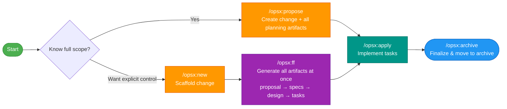

# OpenSpec Workflow Flows

Visual reference for the two primary OpenSpec workflow modes. For full command details see the [OpenSpec workflows documentation](https://github.com/Fission-AI/OpenSpec/blob/main/docs/workflows.md).

---

## Fast-Track Workflow

Use this when you know the full scope upfront and want to move quickly. Two entry points depending on how much explicit control you want.

**Best for:** Small-to-medium features, bug fixes, well-understood changes.

| Step | Command | Purpose |
|------|---------|---------|
| 1 | `/opsx:propose` | Create change + all planning artifacts in one shot (core profile) |
| — | `/opsx:new` + `/opsx:ff` | Alternative: scaffold first, then fast-forward all artifacts |
| 2 | `/opsx:apply` | Implement all tasks |
| 3 | `/opsx:archive` | Finalize, sync specs, move to archive |

---

## Detailed Design Workflow (with `continue`)

Use this when requirements are unclear, you want to review each artifact before moving on, or the work is complex enough to warrant step-by-step control.

**Best for:** Performance optimisation, architectural decisions, debugging, unclear or evolving requirements.

```mermaid
flowchart LR
    A([Start]) --> B{Requirements\nclear?}

    B -- No --> C["/opsx:explore\nInvestigate & clarify\nproblem space"]
    B -- Yes --> D["/opsx:new\nScaffold change\ndirectory"]
    C --> D

    D --> E["/opsx:continue\nCreate proposal.md\nDefine intent & scope"]
    E --> F["/opsx:continue\nCreate specs/\nRequirements & scenarios"]
    F --> G["/opsx:continue\nCreate design.md\nArchitecture & decisions"]
    G --> H["/opsx:continue\nCreate tasks.md\nImplementation checklist"]

    H --> I{Artifacts\nready?}
    I -- "Needs refinement" --> E
    I -- Ready --> J["/opsx:apply\nImplement all tasks"]

    J --> K["/opsx:verify\nValidate completeness,\ncorrectness & coherence"]

    K --> L{Issues\nfound?}
    L -- "Critical issues" --> J
    L -- "Minor warnings\nonly" --> M["/opsx:sync (optional)\nMerge delta specs\nto main specs"]
    L -- "No issues" --> M
    M --> N(["/opsx:archive\nFinalize, sync specs\n& move to archive"])

    style A fill:#4CAF50,color:#fff,stroke:#388E3C
    style N fill:#2196F3,color:#fff,stroke:#1565C0
    style C fill:#FF9800,color:#fff,stroke:#E65100
    style D fill:#FF9800,color:#fff,stroke:#E65100
    style E fill:#9C27B0,color:#fff,stroke:#6A1B9A
    style F fill:#9C27B0,color:#fff,stroke:#6A1B9A
    style G fill:#9C27B0,color:#fff,stroke:#6A1B9A
    style H fill:#9C27B0,color:#fff,stroke:#6A1B9A
    style J fill:#009688,color:#fff,stroke:#00695C
    style K fill:#F44336,color:#fff,stroke:#B71C1C
    style M fill:#607D8B,color:#fff,stroke:#37474F
```

| Step | Command | Purpose |
|------|---------|---------|
| 0 _(optional)_ | `/opsx:explore` | Investigate codebase, clarify requirements before committing |
| 1 | `/opsx:new` | Scaffold the change directory |
| 2 | `/opsx:continue` | Create `proposal.md` — intent & scope |
| 3 | `/opsx:continue` | Create `specs/` — requirements & scenarios |
| 4 | `/opsx:continue` | Create `design.md` — architecture & decisions |
| 5 | `/opsx:continue` | Create `tasks.md` — implementation checklist |
| 6 | `/opsx:apply` | Implement all tasks |
| 7 | `/opsx:verify` | Validate completeness, correctness & coherence |
| 8 _(optional)_ | `/opsx:sync` | Merge delta specs to main specs early |
| 9 | `/opsx:archive` | Finalize, sync specs if needed, move to archive |

---

## Quick Decision Guide

| Situation | Recommended path |
|-----------|-----------------|
| Clear requirements, ready to build | Fast-track (`/opsx:propose` or `/opsx:ff`) |
| Exploring or unclear requirements | Detailed (`/opsx:explore` → `/opsx:continue`) |
| Want to review each artifact step | Detailed (`/opsx:continue`) |
| Time pressure, need to move fast | Fast-track (`/opsx:ff`) |
| Complex change, want full control | Detailed (`/opsx:continue`) |
| Iterating on proposal before specs | Detailed (`/opsx:continue`) |

---

## Related

- [OpenSpec Workflows Documentation](https://github.com/Fission-AI/OpenSpec/blob/main/docs/workflows.md)
- [OpenSpec Commands Reference](https://github.com/Fission-AI/OpenSpec/blob/main/docs/commands.md)
